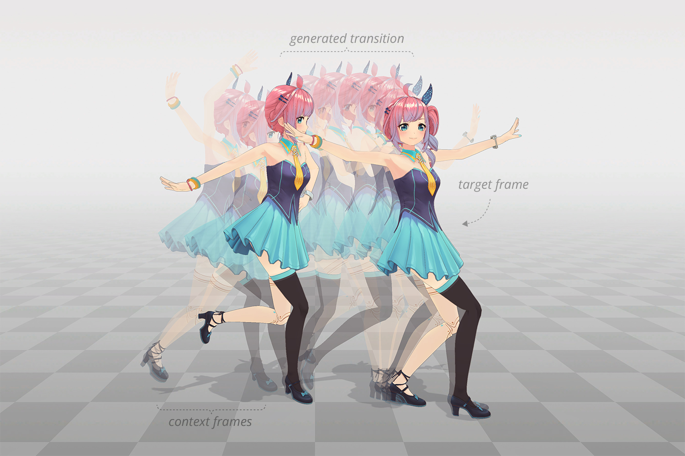
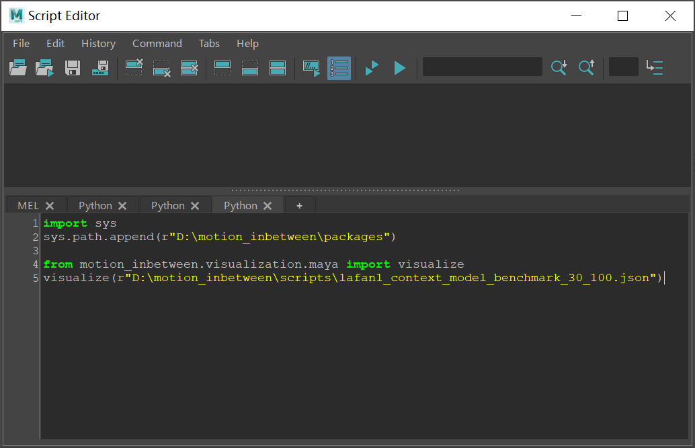

# Motion In-betweening via Two-stage Transformers



Jia Qin, Youyi Zheng, and Kun Zhou. 2022. Motion In-betweening via Two-stage
Transformers. ACM Trans. Graph. 41, 6, Article 184 (December 2022),
16 pages. https://doi.org/10.1145/3550454.3555454

## Getting Started

1. Download [LAFAN1](https://github.com/ubisoft/ubisoft-laforge-animation-dataset) dataset.

2. Extract  `lafan1.zip`  to `datasets` folder.  Bvh files should be located in `motion_inbetweening/datasets/lafan1` folder.

3. Download the [pre-trained models](https://github.com/victorqin/motion_inbetweening/releases/download/v1.0.0/pre-treained.zip) from the Releases Page. Extract it to the `motion_inbetweening/experiments` folder.

4. Install [PyTorch](https://pytorch.org). The code has been tested in Python3.8, PyTorch-1.8.2.

## Run Baseline Benchmark

Under `scripts` folder, run `python run_baseline_benchmark.py lafan1_context_model`

This will give you the same baseline results shown in [Robust Motion In-betweening](https://montreal.ubisoft.com/en/automatic-in-betweening-for-faster-animation-authoring/) (Harvey et al., 2020) paper. If the LAFAN1 dataset has been properly set up, you are expected to see the following results:

```bash
trans:  5
zerov_pos: 1.5231, zerov_quat: 0.56, zerov_npss: 0.0053
inter_pos: 0.3729, inter_quat: 0.22, inter_npss: 0.0023
trans: 15
zerov_pos: 3.6946, zerov_quat: 1.10, zerov_npss: 0.0522
inter_pos: 1.2489, inter_quat: 0.62, inter_npss: 0.0391
trans: 30
zerov_pos: 6.6005, zerov_quat: 1.51, zerov_npss: 0.2318
inter_pos: 2.3159, inter_quat: 0.98, inter_npss: 0.2013
trans: 45
zerov_pos: 9.3293, zerov_quat: 1.81, zerov_npss: 0.4918
inter_pos: 3.4471, inter_quat: 1.25, inter_npss: 0.4493
```

## Generate Transition

To use the full method (Detail + Context Transformer) to generate in-betweening, run `eval_detail_model.py`.

Usage:

```bash
usage: eval_detail_model.py [-h] [-s DATASET] [-i INDEX] [-t TRANS] [-d] [-p] det_config ctx_config

Evaluate detail model. No post-processing applied by default.

positional arguments:
  det_config            detail config name
  ctx_config            context config name

optional arguments:
  -h, --help            show this help message and exit
  -s DATASET, --dataset DATASET
                        dataset name (default=benchmark)
  -i INDEX, --index INDEX
                        data index
  -t TRANS, --trans TRANS
                        transition length (default=30)
  -d, --debug           debug mode
  -p, --post_processing
                        apply post-processing
```

Examples:

1. Get benchmark stats on LAFAN1 dataset with transition=5 frames:

   ```bash
   python eval_detail_model.py lafan1_detail_model lafan1_context_model -t 5
   ```

   You are expected to see the same stats shown in our paper:

   ```bash
   trans 5: gpos: 0.1049, gquat: 0.0994, npss: 0.0011
   ```

   Try other transition lengths and you should get:

   ```bash
   trans 15: gpos: 0.3943, gquat: 0.2839, npss: 0.0188
   trans 30: gpos: 0.8948, gquat: 0.5446, npss: 0.1124
   trans 45: gpos: 1.6777, gquat: 0.8727, npss: 0.3217
   ```

2. Generate 30 transition frames based on the clip with index=100 in LAFAN1 benchmark dataset:

   ```bash
   python eval_detail_model.py lafan1_detail_model lafan1_context_model -t 30 -i 100
   ```

   You should get the generated transition and the corresponding ground truth in JSON format under the `scripts` folder:

   ```bash
   lafan1_detail_model_constraints_benchmark_30_100.json
   lafan1_detail_model_constraints_benchmark_30_100_gt.json
   ```

## Generate Transition by Context Transformer Only

If you prefer to use only Context Transformer, run `eval_context_model.py`. Its usage is very similar to `eval_detail_model.py`. Run `python eval_context_model.py -h` to see its usage info.

Examples:

1. Get benchmark stats on LAFAN1 dataset with transition=5 frames.

   Context Transformer only, **WITHOUT** post-processing:

   ```bash
   python eval_context_model.py lafan1_context_model -t 5
   ```

   ```bash
   trans 5: gpos: 0.1717, gquat: 0.1325, npss: 0.0015
   ```

   Results of other transition lengths:

   ```bash
   trans 15: gpos: 0.4923, gquat: 0.3287, npss: 0.0212
   trans 30: gpos: 1.0663, gquat: 0.5991, npss: 0.1238
   trans 45: gpos: 1.9972, gquat: 0.9170, npss: 0.3369
   ```

   Context Transformer only, **WITH** post-processing:

   ```bash
   python eval_context_model.py lafan1_context_model -t 5 -p
   ```

   ```bash
   trans 5: gpos: 0.1288, gquat: 0.1143, npss: 0.0015 (w/ post-processing)
   ```

   Results of other transition lengths:

   ```bash
   trans 15: gpos: 0.4623, gquat: 0.3154, npss: 0.0211 (w/ post-processing)
   trans 30: gpos: 1.0354, gquat: 0.5898, npss: 0.1210 (w/ post-processing)
   trans 45: gpos: 1.9439, gquat: 0.9114, npss: 0.3349 (w/ post-processing)
   ```

2. Generate 30 transition frames based on the clip with index=100 in LAFAN1 benchmark dataset with post-processing:

   ```bash
   python eval_context_model.py lafan1_context_model -t 30 -i 100 -p
   ```

   You should get the predicted transition and the ground truth in JSON format under the `scripts` folder:

   ```bash
   lafan1_context_model_constraints_benchmark_30_100.json
   lafan1_context_model_constraints_benchmark_30_100_gt.json
   ```

## Visualize Output Motion in Autodesk Maya

Use the `visualize` function in `motion_inbetween.visualization.maya` module to load motions in JSON format:



## Training From Scratch

If you want to train the models by yourself, install visdom to visualize training statistics.

   ```bash
   pip install visdom
   ```

Launch visdom local server before training starts:

   ```bash
   $ visdom
   Checking for scripts.
   It's Alive!
   ```

First train the Context Transformer by running `train_context_model.py`.

   ```bash
   usage: train_context_model.py [-h] config

   Train context model.

   positional arguments:
   config      config name

   optional arguments:
   -h, --help  show this help message and exit
   ```

   Example:

   ```bash
   python train_context_model.py lafan1_context_model
   ```

Then train Detail Transformer by running `train_detail_model.py`.

   ```bash
   usage: train_detail_model.py [-h] det_config ctx_config

   Train detail model.

   positional arguments:
   det_config  detail config name
   ctx_config  context config name

   optional arguments:
   -h, --help  show this help message and exit
   ```

   Example:

   ```bash
   python train_detail_model.py lafan1_detail_model lafan1_context_model
   ```
